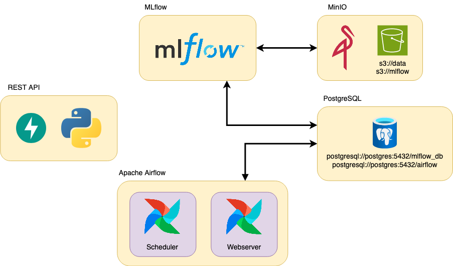

# Proyecto final para Aprendizaje de Máquinas II.
### CEIA - FIUBA

El proyecto aquí detallado se realizó como proyecto final de la asignatura **Aprendizaje de Máquinas II**, en la **Carrera de Especialización en Inteligencia Artificial** de la **Universidad de Buenos Aires**.

## Contexto

Se trabaja para la empresa **ML Models and something more Inc.**, la cual ofrece un servicio que proporciona modelos mediante una REST API. Internamente, tanto para realizar tareas de DataOps como de MLOps, la empresa cuenta con varios servicios que ayudan a ejecutar las acciones necesarias. También dispone de un Data Lake en S3, para este caso, simularemos un S3 utilizando MinIO.

## Arquitectura de la Implementación

Para simular esta empresa, utilizaremos Docker y, a través de Docker Compose, desplegaremos 
varios contenedores que representan distintos servicios en un entorno productivo.



## Servicios Utilizados

* [![MLflow][MLflow]][mlflow-url]
* [![Apache Airflow][Apache-Airflow]][airflow-url]
* [![MinIO][MinIO]][minio-url]
* [![PostgreSQL][PostgreSQL]][postgresql-url]
* [![FastAPI][FastAPI]][fastapi-url]

Por defecto, cuando se inician los multi-contenedores, se crean los siguientes buckets:

- `s3://data`
- `s3://mlflow` (usada por MLflow para guardar los artefactos).

y las siguientes bases de datos:

- `mlflow_db` (usada por MLflow).
- `airflow` (usada por Airflow).

## Capturas del proyecto en ejecución 

Este proyecto está implementado utilizando contenedores en Docker para facilitar su deployment. Las librerías necesarias se instalan al momento de levantar los contenedores del proyecto.

**Docker desktop - Containers running**
![Docker Desktop - Containers][containers]

**Airflow webserver - DAGs**
![Airflow webserver - DAGs][dags]

**Airflow webserver - ETL graph**
![Airflow webserver - ETL graph][airflow_etl]

**Minio - Processed datasets**
![Minio - Processed datasets][minio_dataset]

**Jupyter notebook - Optuna experiment**
![Jupyter notebook - Optuna experiment][jupyter_experiment]

**Airflow webserver - Retrain graph**
![Airflow webserver - Retrain graph][airflow_retrain]

**MLflow - Experiments catalog**
![MLflow - Experiments catalog][mlflow_experiments]

**MLflow - Models catalog**
![MLflow - Models catalog][mlflow_models]

**Fast API - Inference**
![Fast API - Inference][fastapi_inference]

**Powershell terminal - Inference**
![Powershell terminal - Inference][terminal_inference]

## Instalación

1. Para poder levantar todos los servicios, primero instala [Docker](https://docs.docker.com/engine/install/) en tu 
computadora (o en el servidor que desees usar).

2. Clona este repositorio.

3. Crea las carpetas `airflow/config`, `airflow/dags`, `airflow/logs`, `airflow/plugins`, 
`airflow/logs`.

4. Si estás en Linux o MacOS, en el archivo `.env`, reemplaza `AIRFLOW_UID` por el de tu 
usuario o alguno que consideres oportuno (para encontrar el UID, usa el comando 
`id -u <username>`). De lo contrario, Airflow dejará sus carpetas internas como root y no 
podrás subir DAGs (en `airflow/dags`) o plugins, etc.

5. En la carpeta raíz de este repositorio, ejecuta:

```bash
docker compose --profile all up
```

6. Una vez que todos los servicios estén funcionando (verifica con el comando `docker ps -a` 
que todos los servicios estén healthy o revisa en Docker Desktop), podrás acceder a los 
diferentes servicios mediante:
   - Apache Airflow: http://localhost:8080
   - MLflow: http://localhost:5000
   - MinIO: http://localhost:9000 (ventana de administración de Buckets)
   - API: http://localhost:8800/
   - Documentación de la API: http://localhost:8800/docs

Si estás usando un servidor externo a tu computadora de trabajo, reemplaza `localhost` por su IP 
(puede ser una privada si tu servidor está en tu LAN o una IP pública si no; revisa firewalls 
u otras reglas que eviten las conexiones).

7. Para el entrenamiento del primer modelo de forma local es necesario levantar el entorno virtual
utilizando el `pipfile` encontrado en `/notebook_experiments`. Para esto, debes ubicarte dentro del
directorio mencionado con la terminal y ejecutar el siguiente comando:

```bash
pip install pipenv
pipenv install
```

Si se desea utilizar un entorno virtual propio, verificar que la versión de scikit-learn se corresponda
con la utilizada en airflow. (verificar la versión en `/dockerfiles/airflow/requirements.txt`)

## Apagar los servicios

Estos servicios ocupan cierta cantidad de memoria RAM y procesamiento, por lo que cuando no 
se están utilizando, se recomienda detenerlos. Para hacerlo, ejecuta el siguiente comando:

```bash
docker compose --profile all down
```

Si deseas no solo detenerlos, sino también eliminar toda la infraestructura (liberando espacio en disco), 
utiliza el siguiente comando:

```bash
docker compose down --rmi all --volumes
```

Nota: Si haces esto, perderás todo en los buckets y bases de datos.

<!-- MARKDOWN LINKS & images -->
<!-- https://www.markdownguide.org/basic-syntax/#reference-style-links -->
[containers]: screenshots/02_docker_desktop_containers.png
[dags]: screenshots/03_airflow_pre_run.png
[airflow_etl]: screenshots/03_airflow_run_etl.png
[minio_dataset]: screenshots/04_minio_etl_datasets.png
[jupyter_experiment]: screenshots/06_notebook_experiment.png
[airflow_retrain]: screenshots/08_airflow_run_retrain.png
[mlflow_experiments]: screenshots/09_mlflow_catalog.png
[mlflow_models]: screenshots/11_mlflow_models.png
[fastapi_inference]: screenshots/14_fastapi_inference.png
[terminal_inference]: screenshots/15_powershell_inference.png


[MLflow]: https://img.shields.io/badge/MLflow-0194E2?style=for-the-badge&logo=MLflow&logoColor=white
[mlflow-url]: https://mlflow.org/
[Apache-Airflow]: https://img.shields.io/badge/Airflow-017CEE?style=for-the-badge&logo=Apache%20Airflow&logoColor=white
[airflow-url]: https://airflow.apache.org/
[MinIO]: https://img.shields.io/badge/MinIO-C72E49?style=for-the-badge&logo=MinIO&logoColor=white
[minio-url]: https://min.io
[PostgreSQL]: https://img.shields.io/badge/PostgreSQL-316192?style=for-the-badge&logo=postgresql&logoColor=white
[postgresql-url]: https://www.postgresql.org/
[FastAPI]: https://img.shields.io/badge/fastapi-109989?style=for-the-badge&logo=FASTAPI&logoColor=white
[fastapi-url]: https://fastapi.tiangolo.com/